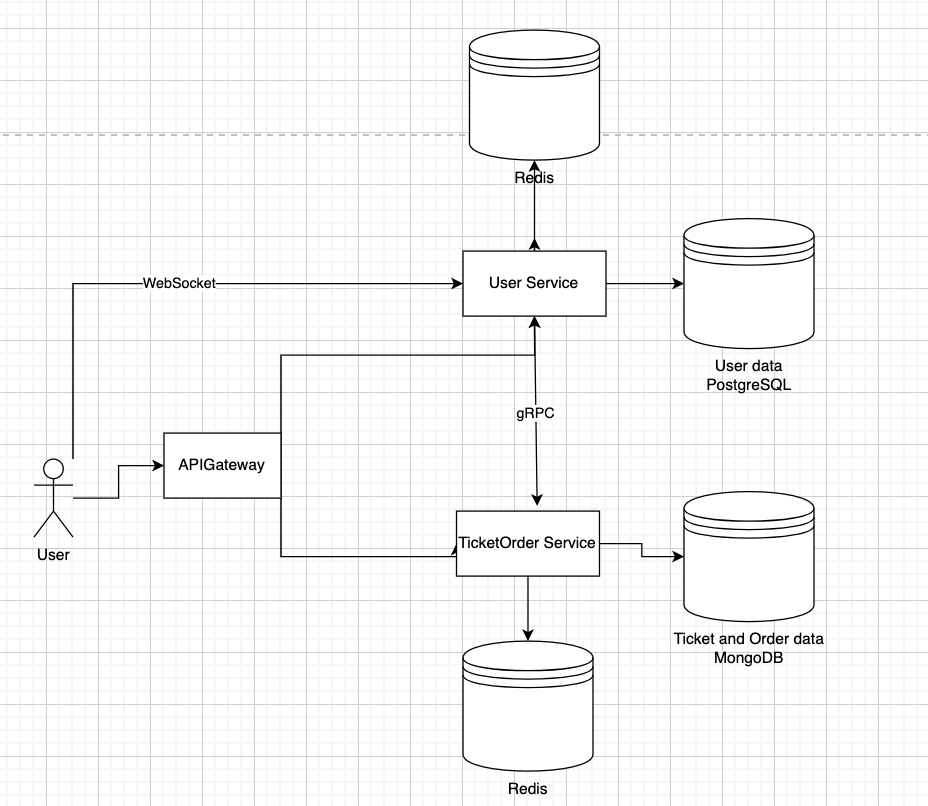

# Course: PAD

## Author: Corețchi Mihai FAF-211

## Topic: E-Ticket (Market place for purchasing tickets for events)

## Assess Application Suitability:

People prefer purchasing tickets online for avoiding long queues and immediate access to a broad range of events. Such market place should be distributed systems because:

- The system should handling sudden traffic spikes.
- Selling tickets requires real-time updates on seat availability. Delayed or inaccurate data can lead to overselling tickets or showing tickets as unavailable when they are still on sale.
- Global market access: A centralized system can struggle with regulatory, currency, and latency issues when serving a global user base. A distributed system enables localization features, such as handling various currencies, languages, and compliance with local data regulations like GDPR or CCPA.

An example of similar a product is Ticketmaster (https://www.ticketmaster.com/), it handles ticket sales for major events and uses distributed systems to manage the high traffic volume during popular event releases and prevent system overloads. They experienced site crashes when Taylor Swift’s tickets went on sale. To prevent this, they rely on distributed cloud infrastructure to scale up resources automatically.

## Define Service Boundaries:



## Technology Stack and Communication Patterns:

- User Service
  - NodeJS - RESTful APIs, Express
  - PostgresSQL
- Ticket Order Service
  - NodeJS - RESTful APIs, Express
  - MongoDB
- APIGateway
    - C# - RESTful APIs, ASP.NET Core

## Design Data Management:

### User service

 - `POST /user/register` - Register a new user.
- `POST /user/login` - Login.
- `GET /user/{id}` - Get user details by ID.
- `GET /user` - Get a list of all users.
- `POST /event` - Create a new event.
- `GET /event` - List all events.
- `GET /event/{id}` - Get event details by ID.

- `GET /notification` - this will establish the connection with UserService, when the payment when the payment is is pending it will notify the user
- `Post /subscribe/event` - web socket, the user will subscribe to the event, when event date is coming close the users subscribed to event will be notify


#### User

```json
{
"id": "string",
"email": "string",
"password": "string",
}
```

#### Event

```json
{
"id": "string",
"name": "string",
"description": "string",
"date_time": "string",
"venue": {
"id": "string",
"name": "string",
"location": "string",
"capacity": "number"
},
"available_seats": "number",
"total_seats": "number"
}
```

### Ticket Order Service

 - `POST /order` - Place a new order.
 - `GET /order/{id}` - Retrieve order details.
 - `POST /payment` - Process a payment.
 - `GET /payment/{id}` - Get payment status.

#### Order

```json
{
"id": "string",
"user_id": "string",
"event_id": "string",
"quantity": "number",
"total_price": "number",
"order_status": "string",
"payment_details": {
"method": "string",
"status": "string"
}
}
```

#### Payment

```json
{
"id": "string",
"order_id": "string",
"amount": "number",
"payment_method": "string",
"payment_status": "string",
}
```

### Notification

```json
{
"user_id": "string",
"message": "string",
}
```
gRPC for communication between services

## Deployment and Scaling:

Docker Compose will be used to containerize and deploy each microservice independently, for scaling, isolated environments, and to simplified deployment across different platforms.
