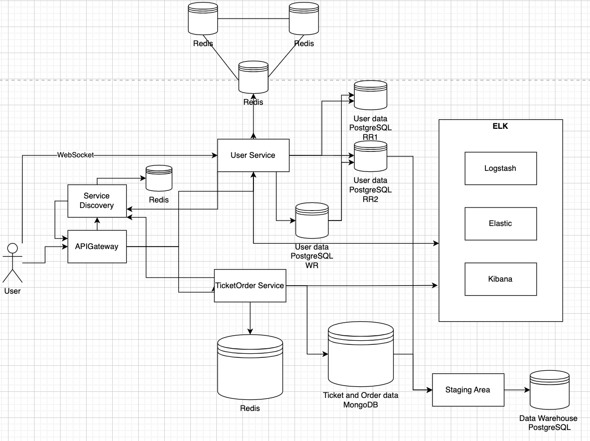

# Course: PAD

## Author: Corețchi Mihai FAF-211

## Topic: E-Ticket (Market place for purchasing tickets for events)

## Assess Application Suitability:

People prefer purchasing tickets online for avoiding long queues and immediate access to a broad range of events. Such market place should be distributed systems because:

- The system should handling sudden traffic spikes.
- Selling tickets requires real-time updates on seat availability. Delayed or inaccurate data can lead to overselling tickets or showing tickets as unavailable when they are still on sale.
- Global market access: A centralized system can struggle with regulatory, currency, and latency issues when serving a global user base. A distributed system enables localization features, such as handling various currencies, languages, and compliance with local data regulations like GDPR or CCPA.

An example of similar a product is Ticketmaster (https://www.ticketmaster.com/), it handles ticket sales for major events and uses distributed systems to manage the high traffic volume during popular event releases and prevent system overloads. They experienced site crashes when Taylor Swift’s tickets went on sale. To prevent this, they rely on distributed cloud infrastructure to scale up resources automatically.

## Define Service Boundaries:




## Technology Stack and Communication Patterns:

- User Service
  - NodeJS - RESTful APIs, Express
  - PostgresSQL
- Ticket Order Service
  - NodeJS - RESTful APIs, Express
  - MongoDB
- APIGateway
    - C# - RESTful APIs, ASP.NET Core
    - Responsibilities:
      - Single entry point for client requests
      - Request routing to appropriate services
      - Handling cross-cutting concerns
      - Implementing circuit breaker pattern

## Design Data Management:

### User service

 - `POST /user/register` - Register a new user.
- `POST /user/login` - Login.
- `GET /user/{id}` - Get user details by ID.
- `GET /user` - Get a list of all users.
- `POST /event` - Create a new event.
- `GET /event` - List all events.
- `GET /event/{id}` - Get event details by ID.

- `GET /notification` - this will establish the connection with UserService, when the payment when the payment is is pending it will notify the user
- `Post /subscribe/event` - web socket, the user will subscribe to the event, when event date is coming close the users subscribed to event will be notify


#### User

```json
{
"id": "string",
"email": "string",
"password": "string",
}
```

#### Event

```json
{
"id": "string",
"name": "string",
"description": "string",
"date_time": "string",
"venue": {
"id": "string",
"name": "string",
"location": "string",
"capacity": "number"
},
"available_seats": "number",
"total_seats": "number"
}
```

### Ticket Order Service

 - `POST /order` - Place a new order.
 - `GET /order/{id}` - Retrieve order details.
 - `POST /payment` - Process a payment.
 - `GET /payment/{id}` - Get payment status.

#### Order

```json
{
"id": "string",
"user_id": "string",
"event_id": "string",
"quantity": "number",
"total_price": "number",
"order_status": "string",
"payment_details": {
"method": "string",
"status": "string"
}
}
```

#### Payment

```json
{
"id": "string",
"order_id": "string",
"amount": "number",
"payment_method": "string",
"payment_status": "string",
}
```

### Notification

```json
{
"user_id": "string",
"message": "string",
}
```
gRPC for communication between services

## Deployment and Scaling:

Docker Compose will be used to containerize and deploy each microservice independently, for scaling, isolated environments, and to simplified deployment across different platforms.

```json
docker compose up --build
```

### Circuit Breaker Pattern
  - Purpose: Protect the system from cascading failures by preventing calls to a service that is likely to fail.
  - Implementation:
    - Configure policies for handling transient faults, defining thresholds for failures.
    - Wrap external service calls in the API Gateway with circuit breaker policies.
  
### ELK Stack
  - Purpose: Centralized logging and monitoring for better observability.
  - Implementation Steps:
    - Elasticsearch: Deploy as the central log storage.
    - Logstash: Set up to collect logs from all services.
    - Kibana: Use for visualizing logs and creating dashboards.
    - Configure the User Service and Ticket Order Service and API Gateway to send logs to Logstash.

### Two-Phase Commit
  - Purpose: Ensure atomicity in distributed transactions that span multiple services and databases.
  - Implementation Steps:
   - Implement a transaction coordinator module within the Ticket Order Service.
   - Phase 1 (Prepare Phase):
      - The Ticket Order Service requests the User Service to reserve seats.
      - Both services prepare to commit changes and lock necessary resources.
   - Phase 2 (Commit Phase):
      - If both services are ready, they commit the transaction.
      - If any service fails, both services roll back changes.

### Consistent Hashing for Cache
  - Purpose: Efficient distribution of cache entries to reduce cache misses and ensure scalability.
  - Implementation Steps:
    - Use Redis Cluster across services.
    - Implement consistent hashing to evenly distribute keys across cache nodes.

### Cache High Availability
  - Purpose: Ensure the caching layer remains available even if some cache nodes fail.
  - Implementation Steps:
    - Configure Redis with replication master-slave setup for high availability.
    - Ensure that the services can detect a failed cache node and redirect requests to a replica.

### Database Replication and Failover
  - Purpose: Enhance data availability and reliability.
  - Implementation Steps:
    - PostgreSQL (User Service): Set up streaming replication with three replicas one primary, two standbys.

### Data Warehouse and ETL
  - Purpose: Consolidate data for analytics and reporting.
  - Implementation Steps:
    - Set up a data warehouse using a PostgreSQL.
    - Develop ETL processes to extract data from PostgreSQL and MongoDB.
    - Schedule periodic updates to sync data.


 